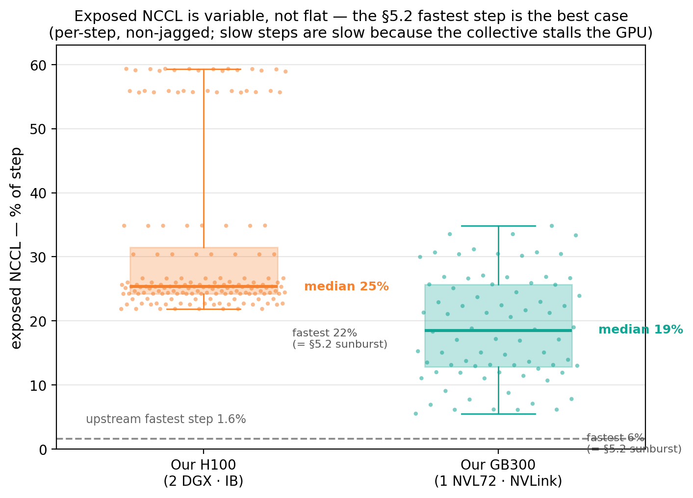
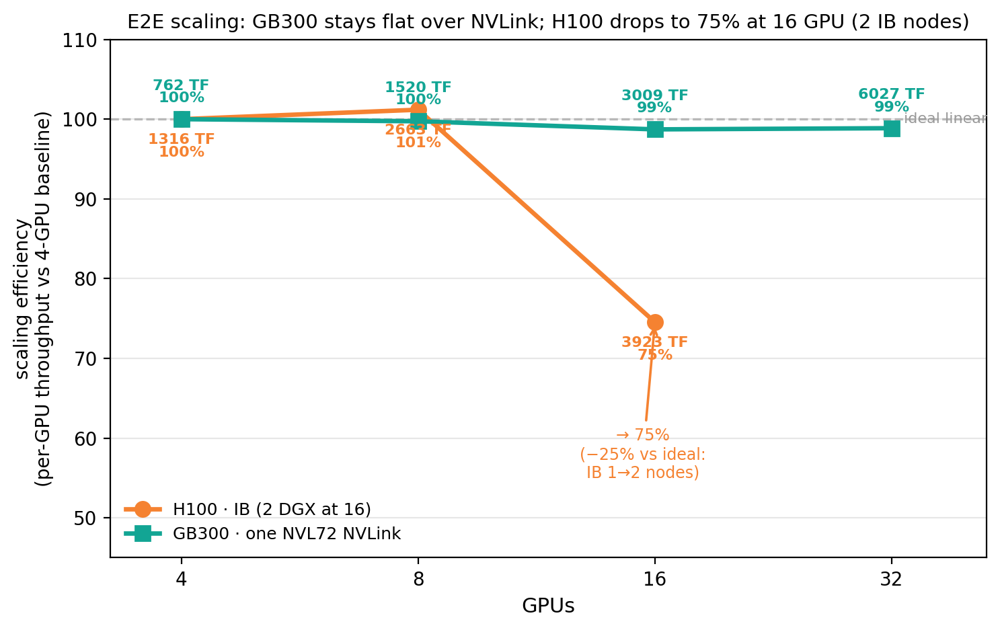
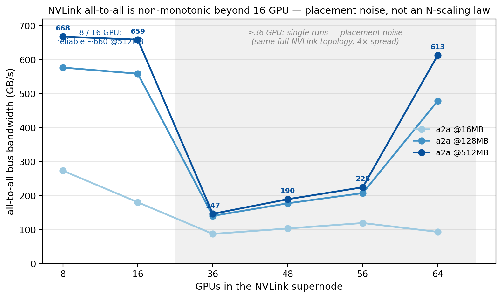
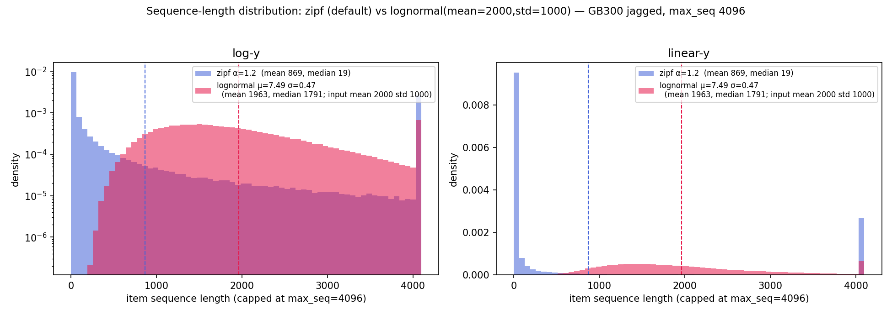
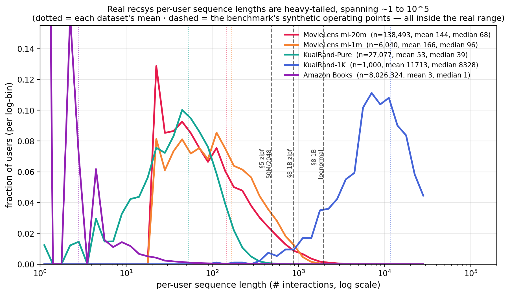
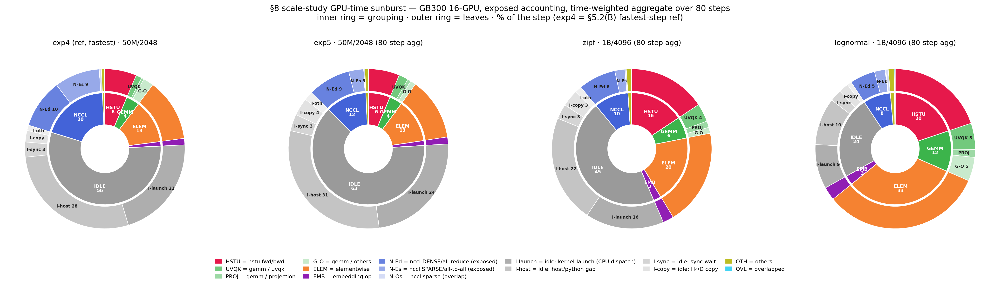
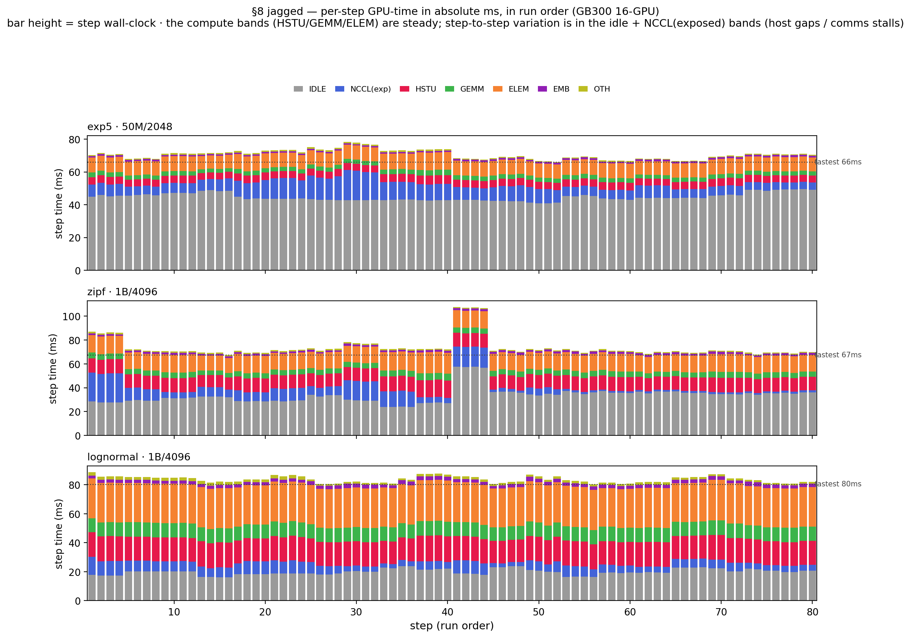

# HSTU on GB300 NVL72 — benchmark results (recsys-examples v26.05)

Generative-recommender (HSTU, arXiv:2402.17152) **training** benchmark, **GB300 (arm64 / sm_103 / CUDA 13)** vs
**H100 (x86 / sm_90 / cu128)**, both on recsys-examples **v26.05**. GB300 numbers are from the **py3.12 parity image**;
H100 numbers are from the **cu128 build** (the sm_90/cu12.8 parity build — v26.05/cu13 cannot run on our driver-535
H100 nodes).

> **Read this first.**
> - **MFU is on the bf16 dense peaks** — GB300 **2500 TFLOPS**, H100 **989 TFLOPS** — so cross-platform MFU here
>   IS comparable.
> - **Measured vs modeled.** Step-time and tokens/sec are directly measured. **TFLOPS *and* MFU both rest on the modeled HSTU
>   FLOP count** (backward = forward × 2.5, not hardware-counted; MFU = achieved-TFLOPS / peak, so it inherits the same model).
>   They're valid for comparison — upstream uses the same model — but across platforms compare via **MFU** (% of each GPU's
>   peak); raw absolute TFLOPS aren't comparable across different hardware.
> - **Build asymmetry:** same v26.05 **and same py3.12 / torch 2.9.1**, but GB300 = arm64/sm_103/CUDA-13 and
>   H100 = x86/sm_90/cu128 — a hardware **and** CUDA-stack comparison, not silicon-only.

## Environment / provenance
Both platforms run the **same recsys-examples v26.05** and **the same Python 3.12 / torch 2.9.1** — the comparison
isolates hardware + kernel-stack (arm64/sm_103/CUDA-13 vs x86/sm_90/CUDA-12.8), not framework version.

| | **GB300 (arm)** | **H100 (x86, control)** |
|---|---|---|
| Image | `…/aarch64/reckon/data.reckon.mlx.image_15225_sg:e90b0ed5…` (v26.05, arm64) | `recsys:v2605-h100-cu128` build `b5746f44` (base `5b34255e`, from `nvcr.io/nvidia/pytorch:25.06-py3`) |
| GPU / arch | NVIDIA **GB300**, sm_103, driver 580.105.08 | NVIDIA **H100 80GB HBM3**, sm_90, driver 535.129 |
| CUDA | 13.0 | 12.8 |
| Python / torch | 3.12 / **2.9.1+cu130** | 3.12 / **2.9.1+cu128** |
| FBGEMM / TorchRec / Megatron | v1.5.0 / v1.5.0 / core_v0.13.1 | v1.5.0 / v1.5.0 / core_v0.13.1 |
| HSTU kernel build | `fbgemm_gpu_hstu` (`HSTU_ARCH_LIST="8.0 9.0 10.0"`) + Blackwell CuTe-DSL (sm_103) | `fbgemm_gpu_hstu` (`TORCH_CUDA_ARCH_LIST="9.0"`) — mature Hopper CUTLASS |
| bf16 dense peak (for MFU) | **2500** TFLOPS | **989** TFLOPS |
| HBM | 284 GB (nvidia-smi) | 80 GB |
| Deviations vs upstream | TransformerEngine deferred (DEBUG/triton + pytorch layer paths); runtime numpy/.pth/ctxfix shims | apex CUDA-ext rebuilt for torch 2.9.1/sm_90; TE uninstalled (2.9.1 ABI break) |

> **Why H100 is cu128, not cu13:** the VA H100 nodes run driver 535.129, which cannot run CUDA 13 (needs ≥580). So the
> H100 control is the sm_90/cu12.8 parity build of the *same* v26.05 — a hardware **and** CUDA-stack comparison.

---

# PART I — UPSTREAM BENCHMARKS

**§1–§5 use the upstream recsys-examples scripts.** §1 is [real-data training](https://github.com/NVIDIA/recsys-examples/tree/main/examples/hstu/training)
(KuaiRand/MovieLens AUC); §2–§5 are **synthetic** perf benchmarks: §2–§4 the
[benchmark](https://github.com/NVIDIA/recsys-examples/tree/main/examples/hstu/training/benchmark) scripts
`hstu_attn_kernel_benchmark.py`, `hstu_layer_benchmark.py`, `run_all_experiments_local.sh`;
§5 reproduces upstream's [`PERF_ANALYSIS.md`](https://github.com/NVIDIA/recsys-examples/blob/main/examples/hstu/training/benchmark/PERF_ANALYSIS.md).

---

## 1. Real-data correctness + multi-GPU scaling
Multi-task ranking AUC matches our prior v26.04 (py3.11) references → the py3.12 port is numerically correct.
Backends: DEBUG+triton for KuaiRand (contextual), pytorch for MovieLens.

| dataset | platform | GPUs | AUC (task0 / task1) | throughput (TFLOPS, diag) |
|---|---|---|---|---|
| KuaiRand-27K | GB300 | 1 / 2 / 4 | 0.703–0.718 / 0.868 | ~26 / ~71 / ~184 |
| KuaiRand-27K | H100 | 1 | 0.726 / 0.876 | — |
| KuaiRand-Pure | GB300 | 1 | 0.721 / 0.749 | 0.12 (small set) |
| MovieLens-20M | GB300 | 1 / 2 / 4 | 0.795–0.809 / 0.802–0.814 | 0.6 / 1.9 / 5.3 |
| MovieLens-20M | H100 | 1 | 0.815 | — |

Scaling (KuaiRand-27K, DEBUG+triton): **26 → 71 → 184 TFLOPS** across 1→2→4 GPU.

**Cross-platform correctness:** H100 (CUTLASS, the mature Hopper path) reaches KuaiRand-27K 0.726/0.876 and MovieLens-20M
**0.815** — inside the GB300 AUC range, so the GB300 arm/sm_103 port is numerically correct against H100.

---

## 2. HSTU attention-kernel sweep (batch × seqlen heatmaps)
Upstream `hstu_attn_kernel_benchmark.py`, bf16, **full grid** batch∈{1,2,4,8,16,32,64,128} × seqlen∈{128,256,…,16384}
(8×8 = 64 cells) on **both** platforms — **median** over 50 bench iters (after 10 warmup) per cell. GB300 also gets an **extended 9×9** triton-kv256
sweep (batch≤256 × seqlen≤32768) to probe its extra HBM headroom. Values below are the **peak cell** of each grid;
peak TFLOPS is the measured global rate, MFU = TFLOPS/peak (GB300 2500, H100 989).

> The peak is **not** always at the same cell: **CUTLASS** peaks at low batch × long seqlen (BS 2–8, SL 16384);
> **triton** peaks at **high batch** (BS 128, SL 16384). Cell locations are noted per row.
>
> *Why:* both climb with seqlen (attention intensity ∝ SL² compute vs SL memory), so the peak is always at SL 16384.
> They differ on **batch** because they reach GPU occupancy differently: **CUTLASS** (warp-specialized, large tensor-core
> tiles) saturates the tensor cores with just a **few long sequences**, so it peaks at low batch — and it's *capped above*
> by the INT32-overflow cells (greyed `OVF`), which remove the high-BS/long-SL corner entirely. **Triton** (block-parallel,
> a grid over batch×heads×seq-blocks) needs **many concurrent instances to fill the SMs**, so it keeps climbing with batch
> and peaks at BS 128 (no int32 limit — it fills the whole grid). In short: **tensor-core-tile-bound vs occupancy-bound.**

**GB300** (MFU on 2500):

| backend | kv (head_dim) | fwd TF / MFU | bwd MFU | fwd+bwd TF / MFU | peak cell (fwd·f+b) |
|---|---|---|---|---|---|
| **cutlass (Blackwell)** | 128 | **1615 / 64.6%** | 39.8% | **1114 / 44.6%** | BS8·BS32 / SL16384 |
| triton | 128 | 799 / 32.0% | 9.8% | 308 / 12.4% | BS128 / SL16384 |
| triton | 256 | 926 / 37.0% | 9.4% | 296 / 11.8% | BS128 / SL16384 |
| triton | 256 (9×9 extended) | 945 / 37.8% | 10.6% | 335 / 13.4% | SL32768 (BS128·BS256) |

Blackwell CUTLASS at kv128 hits **3 INT32-overflow cells** at the top-right (BS×SL ≥ 2²¹, the int32 memref-descriptor
limit — greyed `OVF` in the heatmap); triton has no such limit and fills the whole grid.

**H100 cu128** (MFU on 989):

| backend | kv (head_dim) | fwd TF / MFU | bwd MFU | fwd+bwd TF / MFU | peak cell (fwd·f+b) |
|---|---|---|---|---|---|
| **cutlass (Hopper)** | 256 | **707 / 71.4%** | 38.7% | 438 / 44.3% | BS32·BS2 / SL16384 |
| cutlass (Hopper) | 128 | 567 / 57.3% | 48.7% | **504 / 50.9%** | BS4·BS2 / SL16384 |
| cutlass (Hopper) | 64 | 480 / 48.5% | 42.7% | 432 / 43.7% | BS16·BS8 / SL16384 |
| triton | 128 | 456 / 46.1% | 27.6% | 306 / 31.0% | BS16·BS64 / SL16384 |
| triton | 256 | 579 / 58.6% | 12.6% | 160 / 16.2% | BS32·BS128 / SL16384 |

**GB300-vs-H100 summary:**
- **Supported shape (head_dim 128), same CUTLASS backend:** GB300 Blackwell **1615 TF / 64.6%** fwd vs H100 Hopper
  **567 / 57.3%** → GB300 = **2.85× absolute fwd** throughput at **1.13× the utilization**; fwd+bwd 1114 vs 504 = **2.21×**;
  and GB300's CUTLASS backward (996 TF / 39.8%) is **~2×** H100's on the same shape. GB300 leads on both axes here.
- **Head_dim 256:** Blackwell CUTLASS can't run 256, so GB300 falls back to **triton (926 / 37.0%)**
  vs H100 mature **CUTLASS (707 / 71.4%)** — GB300 still leads on absolute fwd (**1.31×**) but at ~half the utilization.
- **Same kernel (triton D256):** GB300 926 / 37.0% vs H100 579 / 58.6% — GB300 **1.60×** H100 absolute fwd on the identical kernel.
- **Extended headroom:** GB300's 284 GB HBM runs the 9×9 grid to BS256×SL32768 (peak fwd+bwd 335 TF) where H100's 80 GB OOMs.

**GB300 — Blackwell CUTLASS kv128** (fwd/bwd/fwd+bwd TFLOPS, 8×8; grey `OVF` = INT32 overflow):

**GB300 — triton kv256** (head_dim-256 fallback), extended 9×9 grid (BS≤256 / SeqLen≤32768 — a superset of the 8×8):

**H100 — Hopper CUTLASS kv256** (compare to the [upstream H100 reference](https://github.com/NVIDIA/recsys-examples/tree/main/examples/hstu/training/benchmark#results-single-h100-sxm5-80gb)) and the **matched CUTLASS kv128**:

| 💡 Takeaway |
|:--|
| *The Blackwell CUTLASS kernel delivers ~2–2.85× H100's absolute throughput at head_dim 128 and is slightly higher in utilization (64.6% vs 57.3% MFU = 1.13×). At head_dim 256 it's unavailable, so GB300 falls back to triton (37.0% MFU) while H100 keeps its mature 71.4% Hopper CUTLASS — there GB300's utilization drops to ~half (0.52×).* |

---

## 3. HSTU-layer sweep (fwd+bwd, full layer)
GB300-adapted exp list (upstream defaults use `native`/TE + dim256-cutlass, both invalid on Blackwell, so:
fused/debug, cutlass at dim≤128, triton for 256). bf16, 1 layer, max_seqlen 4096, batch 32; **median** over 100 bench iters (after 50 warmup).

> **Units note:** `max_seqlen 4096` here is sequence **positions** (the post-interleave length the layer bench takes directly). §4/§5's `--max_sequence_length 2048` counts **items** (S), which the e2e trainer doubles (item+action) + adds C=3 → the *same* T ≈ 4096 positions. The two upstream APIs just use different units — not different lengths.

**GB300** (e2e MFU on 2500):

| exp | layer | fwd TF | bwd TF | e2e TF | e2e MFU | speedup |
|---|---|---|---|---|---|---|
| debug_triton_128 | DEBUG | 428.3 | 331.7 | 356.6 | 14.3% | 1.00× |
| **fused_cutlass_128** | FUSED | **727.1** | **687.4** | **699.0** | **28.0%** | **1.96×** |
| fused_cutlass_64 | FUSED | 615.6 | 594.8 | 601.0 | 24.0% | 1.69× |
| fused_triton_256 | FUSED | 706.0 | 322.3 | 388.0 | 15.5% | 1.09× |

**H100 cu128** (MFU on 989; measured layer run; speedup = FUSED vs DEBUG within each head_dim):

| exp | layer | fwd TF | bwd TF | e2e TF | e2e MFU | speedup |
|---|---|---|---|---|---|---|
| debug D128 | DEBUG | 195.1 | 217.7 | 210.5 | 21.3% | 1.00× |
| **fused D128** | FUSED | 361.5 | 365.8 | 360.6 | **36.5%** | **1.71×** |
| debug D256 | DEBUG | 273.0 | 169.0 | 191.7 | 19.4% | 1.00× |
| **fused D256** | FUSED | 454.8 | 381.8 | 400.2 | **40.5%** | **2.09×** |

**GB300 vs H100** (fused layer, per head_dim; **bars = TFLOPS** (left axis), **line = MFU%** (right axis); ↑ higher is better; GB300 teal, H100 orange):

| 💡 Takeaway |
|:--|
| *FUSED + cutlass at dim=128 is ~2× the DEBUG+triton baseline on GB300 (the cutlass backward is the main gain, 687 vs 332 TF); dim=256 must use triton ([Issue #1](upstream_issues/GB300_KERNEL_ISSUES.md)) → bwd drops to triton levels. GB300-vs-H100: at dim 128 GB300 fused-cutlass (699 e2e TF, 28.0% MFU) is ~1.9× H100's absolute throughput (360.6 TF) at ~¾ its utilization (28.0% vs 36.5%). But at dim 256 the two cross over: GB300 is on triton (388 TF / 15.5%) while H100 keeps mature Hopper CUTLASS (400.2 TF / 40.5%), so H100 edges GB300 on absolute e2e throughput and holds ~2.6× the utilization — the one config where GB300's kernel gap costs it the raw-throughput lead too.* |

---

## 4. End-to-end training (synthetic data, progressive optimization)
Synthetic Zipf data, progressively enabling optimizations. Scales up across subsections: **4a = 1 GPU**, **4b = 16 GPU**. (The detailed 16-GPU perf-analysis vs upstream is in [§5](#user-content-5-detailed-performance-analysis--reproducing-upstream-perf_analysismd).)

> **Sequence config:** §4 is **jagged**, `--max_sequence_length 4096` (items → ~8192 positions). §5 uses **2048** items (~4096 positions, to match upstream), and §5.1(A) is **non-jagged** — so §4 and §5 e2e MFU are *not* directly comparable (different length **and** jaggedness).

### 4a. Single-GPU (kv128)
`run_all_experiments_local.sh --benchmark-type=e2e` on **synthetic Zipf data** (not the real datasets of §1), single GPU,
**kv128** ([Issue #1](upstream_issues/GB300_KERNEL_ISSUES.md)). Shown are exp0→exp2 (baseline → shuffler → CUTLASS), where
the lift is. The embedding opts exp3–5 add little even at 16 GPU (§4b), and exp4's hash-RoundRobin is multi-GPU *sharding*
(a no-op on one GPU) — so they'd be ~flat single-GPU:

**GB300** (MFU on 2500):

| exp | TFLOPS (diag) | MFU | speedup |
|---|---:|---:|---:|
| exp0_baseline | 178.8 | 7.2% | 1.00× |
| exp1_shuffler | 177.8 | 7.1% | 1.00× |
| **exp2_cutlass** (Blackwell) | **368.2** | **14.7%** | **2.07×** |

| 💡 Takeaway |
|:--|
| *The CUTLASS (Blackwell) kernel ~2× the e2e training throughput vs the triton baseline/shuffler (178→368 TFLOPS).* |

### 4b. Full exp0–5 ladder × head_dim / backend — H100 + GB300 @ 16 GPU
Three ladders at the §4 config (jagged), reproducing upstream's
[E2E_BENCHMARK](https://github.com/NVIDIA/recsys-examples/blob/main/examples/hstu/training/benchmark/E2E_BENCHMARK.md#2-results)
exp0–5. Blackwell can't do CUTLASS-256, so GB300's kv256 uses Triton and kv128 uses Blackwell CUTLASS; H100 runs mature Hopper
CUTLASS at kv256. **Both avg and peak** per-GPU TFLOPS / MFU over the 1000-iter run (warmup dropped), computed by
[`runtime/nsys_repro/e2e_stats_table.py`](runtime/nsys_repro/e2e_stats_table.py) — matching upstream's own avg+peak columns.
MFU is vs the bf16 **dense** peak — **989** TF/GPU (H100), **2500** TF/GPU (GB300), consistent with §5.

**H100 — kv256, contextual, Hopper CUTLASS** (peak 989 TF/GPU):

| exp | Avg TF/GPU | Avg MFU | Peak TF/GPU | Peak MFU | Speedup |
|---|---:|---:|---:|---:|---:|
| 0 baseline (triton) | 69.6 | 7.04% | 71.3 | 7.21% | 1.00× |
| 1 +shuffler | 97.4 | 9.85% | 104.2 | 10.54% | 1.40× |
| **2 +cutlass** | **202.4** | **20.47%** | **222.6** | **22.50%** | **2.91×** |
| 3 +caching | 203.4 | 20.56% | 227.8 | 23.03% | 2.92× |
| 4 +hash-RR | 205.5 | 20.78% | 229.5 | 23.21% | 2.95× |
| 5 +prefetch | 207.4 | 20.97% | 235.8 | 23.84% | 2.98× |

**GB300-A — kv256, contextual, Triton** (peak 2500 TF/GPU; Blackwell has no CUTLASS-256, so exp2 `+cutlass` would be a no-op
here — omitted — and the ladder stays Triton throughout):

| exp | Avg TF/GPU | Avg MFU | Peak TF/GPU | Peak MFU | Speedup |
|---|---:|---:|---:|---:|---:|
| 0 baseline (triton) | 125.0 | 5.00% | 125.8 | 5.03% | 1.00× |
| 1 +shuffler | 182.3 | 7.29% | 186.0 | 7.44% | 1.46× |
| 3 +caching | 183.9 | 7.36% | 186.9 | 7.48% | 1.47× |
| 4 +hash-RR | 182.6 | 7.30% | 185.5 | 7.42% | 1.46× |
| 5 +prefetch | 180.0 | 7.20% | 183.2 | 7.33% | 1.44× |

**GB300-B — kv128, non-contextual, Blackwell CUTLASS** (peak 2500 TF/GPU):

| exp | Avg TF/GPU | Avg MFU | Peak TF/GPU | Peak MFU | Speedup |
|---|---:|---:|---:|---:|---:|
| 0 baseline (triton) | 113.9 | 4.56% | 116.4 | 4.66% | 1.00× |
| 1 +shuffler | 159.6 | 6.38% | 164.2 | 6.57% | 1.40× |
| **2 +cutlass** | **281.6** | **11.26%** | **305.1** | **12.20%** | **2.47×** |
| 3 +caching | 279.5 | 11.18% | 298.7 | 11.95% | 2.45× |
| 4 +hash-RR | 278.1 | 11.12% | 299.2 | 11.97% | 2.44× |
| 5 +prefetch | 272.2 | 10.89% | 290.6 | 11.62% | 2.39× |

- **CUTLASS is the big lift wherever the hardware supports it:** H100 Hopper CUTLASS-256 jumps **10.54 → 22.50% peak MFU** at
  exp2 (**2.13×**; 2.08× on avg); GB300 Blackwell-128 jumps **6.57 → 12.20%** (**1.86×**; 1.77× avg). GB300's Triton-256 ladder
  (A) never gets it (Blackwell can't do CUTLASS-256) and stays ~7.4%. Upstream's E2E_BENCHMARK reports a larger **4.00×** CUTLASS
  step than ours — why (TODO)?
- **H100 leads on MFU; GB300 on absolute throughput.** At exp4, H100 CUTLASS-256 reaches **23.21% peak MFU** (229.5 TF/GPU on
  the 989 peak) vs GB300-B Blackwell-128 **11.97%** (299.2 TF/GPU on 2500) — yet GB300's absolute rate (299 vs 230 TF/GPU; 4787
  vs 3672 global) is higher.
- **Embedding opts (exp3–5) are ~flat on all three:** at 50M rows the all-to-all is already cheap, so caching/hash-RR/prefetch
  add nothing (slightly negative on GB300) — same shape as upstream's "prefetch flat when a2a is small."
- **Avg is ~90% of peak on the CUTLASS steps** (H100 exp2 20.47/22.50 = 91%; GB300-B exp2 11.26/12.20 = 92%) — the run is
  steady, so peak is representative, not an outlier.

*This is the **§4 config (jagged, default `max_sequence_length`)** — different length **and** jaggedness from §5.1's 2048
non-jagged, so **not directly comparable** to §5's e2e MFU (that's why H100 here is ~23%, not §5.1's 16.86%). H100 also pays a
~26% IB penalty at 8→16 that GB300's single-NVL72 NVLink domain avoids (§6a).*

## 5. Detailed performance analysis — reproducing upstream [`PERF_ANALYSIS.md`](https://github.com/NVIDIA/recsys-examples/blob/main/examples/hstu/training/benchmark/PERF_ANALYSIS.md)
> **Specification recap** (exp config, model, dataset, embedding tables, etc.): see upstream [§1](https://github.com/NVIDIA/recsys-examples/blob/main/examples/hstu/training/benchmark/PERF_ANALYSIS.md#1-spec-recap).

Upstream profiles `exp4_caching_hr` on **16×H100** (rank0). We reproduce its four analyses at the **same 16-GPU scale and
config, S=2048** (`--max_sequence_length 2048`; `T = 2·S + C = 4099`):

- **§5.1** (upstream §2.1) — e2e training summary (upstream: **341.6 TFLOPS/GPU · 34.54% MFU**)
- **§5.2** (upstream §2.2) — GPU-time breakdown
- **§5.3 / §5.4** (upstream §2.3 / §2.4) — attention / UVQK+projection GEMM TFLOPS & MFU

§5.1 = no-nsys median (iters 199–999); §5.2–5.4 = rank0's fastest step under nsys (reconstructing upstream's unscripted analysis). Scripts and measurement conventions are in [`runtime/nsys_repro/`](runtime/nsys_repro/).

Upstream's benchmark is **H100-only and non-jagged**; we expand it two ways:

- **Hardware** — add **GB300** (arm64/sm_103/CUDA-13) beside H100. H100 matches upstream's shape exactly (D256, contextual
  `C=3`); GB300 is forced to **D128 / non-contextual** ([Issue #1](upstream_issues/GB300_KERNEL_ISSUES.md), [Issue #4](upstream_issues/GB300_KERNEL_ISSUES.md)).
- **Jagged** — every subsection adds a **(B) jagged** run beside the **(A) non-jagged** one (upstream's method). (B) keeps the
  same S=2048 run's **real variable lengths** (avg item ≈491, effective T≈983) — *not* upstream-comparable, kept as the contrast.

**Key result.** With config **verified matched** (our H100 = upstream's exact **63.89 TFLOP/step**), our **kernels reproduce
or beat upstream** (attention 42.25% ≥ 38.42%, GEMM 82% > 68%) — yet **e2e is ~2× slower** (16.86% vs 34.54% MFU). Because
the kernels match or beat upstream, the gap must lie **outside them**: §5.2 shows the same config hits a *different bottleneck on each system* — upstream is
**compute-bound**, our H100 is **comms-throttled** (16 GPUs = 2 DGX over IB, so the collectives sit exposed on the critical
path), and our GB300 is **underutilized** (fast, narrow D128 compute under-fills the step — memory-bound elementwise + CPU-launch/host idle). Full per-platform analysis at the §5 end.

#### §5.1 E2E training summary

Both (A)/(B) no-nsys, median over the steady-state window
[**iters 199–999**](https://github.com/NVIDIA/recsys-examples/blob/main/examples/hstu/training/benchmark/PERF_ANALYSIS.md#21-e2e-training-summary)
(the first ~200 iters are warmup, discarded).

**(A) Non-jagged:**

| Metric | Upstream H100 | Our H100 (D256, ctx) | Our GB300 (D128, non-ctx) |
|---|---:|---:|---:|
| Batch size / GPU | 32 | 32 | 32 |
| Effective sequence length `T` | 4,099 | 4,099 | 4,096 |
| Effective tokens / GPU step | 131,168 | 131,168 | 131,072 |
| Training FLOPs / GPU step | 63.89T | 63.89T | 31.89T |
| bf16 dense peak / GPU | 989 | 989 | 2,500 |
| Median step time | 187.01 ms | 383.1 ms | 80.5 ms |
| Median achieved FLOPS/GPU | 341.6 | 166.8 | 396.0 |
| Median MFU/GPU | **34.54%** | **16.86%** | **15.84%** |

**Same config, 2× slower step.** Our H100 reproduces upstream's FLOP model (63.89 TFLOP/step) and its kernels (§5.3/§5.4),
yet the median step is **383.1 ms vs 187.01 ms** → MFU **16.86%**, half of 34.54%. Since the kernels match, the gap is
non-kernel: §5.2 traces it to **exposed NCCL**. Our 16 GPUs span **2 DGX joined by IB**, and §6a measures a ~26% MFU
penalty from that inter-node link at 8→16 that GB300's NVL72 avoids — so the collectives land on the critical path, where
upstream reports the same config at just **1.6%** exposed.
GB300 (D128, half the FLOPs/step) runs each step in **80.5 ms** at **15.84%** — bottlenecked differently again (§5.2).

**(B) Jagged** (same `--max_sequence_length 2048` **cap**, but jagged keeps the **real variable lengths** — measured
avg item length ≈ 491, so effective `T` ≈ 983 vs the non-jagged 4,096; **not** upstream's method):

| Metric | Our H100 (D256, ctx, jagged) | Our GB300 (D128, non-ctx, jagged) |
|---|---:|---:|
| Batch size / GPU | 32 | 32 |
| Effective sequence length `T` (avg) | 986 | 983 |
| Effective tokens / GPU step (avg) | 31,542 | 31,446 |
| Training FLOPs / GPU step | 14.52T | 7.24T |
| bf16 dense peak / GPU | 989 | 2,500 |
| Median step time | 127.8 ms | 61.1 ms |
| Median achieved FLOPS/GPU | 113.6 | 118.3 |
| Median MFU/GPU | **11.49%** | **4.73%** |

Jagged keeps the real (short) sequence lengths, so FLOPs/step fall ~4× and MFU with them — and it hits GB300 harder than
H100: GB300's MFU drops to **4.73%** (only ~30% of its non-jagged 15.84%) vs H100's **11.49%** (~68% of 16.86%), because
short sequences underfill GB300's fast compute (idle 55%, §5.2(B)).

#### §5.2 GPU-time breakdown

We report the **exposed** breakdown (upstream's method, directly comparable): charge each GPU instant to the single active
kernel's category, on **rank0's fastest step** — measured within one step, so between-step gaps don't
inflate `idle`. In each table column below, **bold** marks the largest exposed bucket and *italic* the second-largest.

> ⚠️ **Caveat — the fastest step is a best-case snapshot, not a distribution.** Following upstream, §5.2–5.4 use rank0's
> *fastest* step. On a fixed (non-jagged) shape that's the cleanest single measurement, but the fastest step is also the
> *lowest-comms* step, so it **understates the typical exposed NCCL** (our H100 exposes **21%** on the fastest step but a
> **median 25%**, up to 59%, across steps — the variance figure in §5.2(A)). It's one step, not the run. For the
> statistically robust treatment — the **jagged breakdown time-weighted over all 80 steps** (not the fastest step), with
> the per-step real-time composition — **see [§8](#8-scale-study-reference--1b-row-jagged-perf-zipf-vs-lognormal-gb300)**.

> **Raw timelines:** the Nsight Systems captures behind these breakdowns are in
> [`profiles/`](profiles/) — `{h100,gb300}_{nonjagged,jagged}.nsys-rep`.

**(A) Non-jagged.**

*(All three panels on the fastest step; [upstream H100](https://github.com/NVIDIA/recsys-examples/blob/main/examples/hstu/training/benchmark/figs/gpu_time_breakdown_sunburst.svg)
is its published reference.)*

| exposed, % of the fastest step | Upstream H100 (D256) | Our H100 (D256) | Our GB300 (**D128**) |
|---|---:|---:|---:|
| `hstu fwd/bwd` (attention) | **43.1%** | **33.7%** | 18.5% |
| `gemm / uvqk` | 17.9% | 14.7% | 9.2% |
| `gemm / projection` | 4.8% | 2.6% | 2.8% |
| `gemm / others` | 1.0% | 1.4% | 1.0% |
| `elementwise` | *21.3%* | 18.1% | **36.1%** |
| `embedding op` | 5.7% | 0.9% | 2.7% |
| `GPU idle` | 3.3% | 3.8% | *20.5%* |
| `nccl(exposed)` | 1.6% | *21.9%* | 7.1% |
| `nccl(overlap)` | 0.5% | 0.4% | 0.2% |
| `others` | 0.7% | 2.4% | 1.2% |
| `overlapped` | 0.1% | 0.1% | 0.5% |
| **Total** | 100% | 100% | 100% |
| Nsight trace | — | [`h100_nonjagged.nsys-rep`](profiles/h100_nonjagged.nsys-rep) | [`gb300_nonjagged.nsys-rep`](profiles/gb300_nonjagged.nsys-rep) |

**Why e2e MFU is low — and low differently on each system.** The kernels are efficient everywhere (§5.3/§5.4: per-op MFU
42–83%), so §5.1(A)'s low *e2e* MFU (16.86% / 15.84%) can only mean the FLOP-heavy compute (attention + GEMM) fills a small share of the step. The
exposed split shows what fills the rest:

- **Upstream H100 — compute-bound.** Compute is **~67%** of the step (attention 43% + GEMM 24%); NCCL barely surfaces at **1.6%**. This is the healthy case — yet still only 34.5% MFU, because `exp4_caching_hr` carries ~27% inherent elementwise + embedding overhead on every platform.
- **Our H100 — comms-throttled, and variably so.** The *same* kernels, but exposed NCCL is **21% on the cleanest step** (vs upstream's 1.6%) and **43% on a second capture's fastest step**. The exposed part is **~72% the dense-model gradient all-reduce**, only ~28% the sparse embedding all-to-all ([`exposed_nccl_split.py`](runtime/nsys_repro/exposed_nccl_split.py)). The two carry *comparable total busy-time* (SendRecv ~17% vs AllReduce ~20% of GPU time), but the embedding a2a overlaps compute and **hides**, so what stays **exposed on the critical path is chiefly the dense all-reduce** (which caching/prefetch can't touch, §4b). Our two DGX are IB-joined (§6a's ~26% penalty at 8→16, which GB300's NVL72 avoids), so those collectives sit on the critical path. The fastest step (21%) is the *best* case — across all steps H100 exposes a **median 25%** (up to 59%; see the variance figure below), so on the typical step that sets §5.1's e2e MFU the comms overhead is worse, and *that* is the 2× e2e gap.
- **Our GB300 — underutilized.** D128 halves the FLOPs and Blackwell runs them ~2.5× faster, so attention + GEMM finish in only **~31%** of the step. Nothing useful replaces them: the rest is **memory-bound elementwise (36%)** — norms/activations that neither shrink at D128 nor use the tensor cores — plus **CPU-bound idle (20%)**: kernel-launch dispatch + host-side Python/framework gaps ([`exposed_idle_split.py`](runtime/nsys_repro/exposed_idle_split.py)), because the fast, *many* small D128 kernels outrun the CPU's launch pipeline and the GPU stalls between launches. Its narrow compute simply under-fills the step (NCCL is 7% on this fastest step — ~19% on the typical step, cheaper than H100's IB but not flat, see the variance figure).

| 💡 §5.2(A) Takeaway |
|:--|
| *Same config, efficient kernels — but e2e MFU is set by compute's share of the step: displaced by IB comms on our H100, under-filled by elementwise + CPU-launch/host idle on our GB300.* |

**Exposed NCCL varies step-to-step (the fastest step is the best case).** The (A) breakdown above uses the *fastest* step
(upstream's method), which minimizes comms exposure. Across **all** steps of the capture, exposed NCCL is much higher and
far from flat on both platforms — and **the slower a step, the more NCCL it exposes** (near-linear; corr 0.8–0.99[^corr]): a
step is slow *because* the collective stalls the GPU, so the fastest step is where comms overlapped best:

*(H100 median **25%** vs its fastest **21%**, tail to 59%; GB300 median **19%** vs fastest 7%, to 35% — over NVLink it exposes
less than H100's IB, but is **not** the flat "7%" the fastest step suggests. Both sit far above upstream's 1.6%. `runtime/plot_nccl_variance.py`.)*

[^corr]: Pearson correlation between each step's *duration* and its *exposed-NCCL %*, across all steps of a capture (+1 = perfectly linear, 0 = unrelated): H100 **0.99**, GB300 **0.80** — i.e. the step-to-step time variance is essentially the comms-exposure variance.

**(B) Jagged.**

*(Both from `exp4_caching_hr` captures with **exact** per-kernel GEMM split (H100 fastest step 94 ms). H100-jagged is **comms-dominated**: the short step does little
compute, so the fixed IB collectives loom to 43% (§5.2(A) variance).)*

| exposed, % of the fastest step | Our H100 (D256, jagged) | Our GB300 (**D128**, jagged) |
|---|---:|---:|
| `hstu fwd/bwd` (attention) | *17.1%* | 6.4% |
| `gemm / uvqk` | 7.5% | 1.2% |
| `gemm / projection` | 2.2% | 0.5% |
| `gemm / others` | 0.5% | 2.1% |
| `elementwise` | 11.7% | 12.7% |
| `embedding op` | 1.0% | 1.3% |
| `GPU idle` | 14.6% | **55.5%** |
| `nccl(exposed)` | **43.3%** | *19.1%* |
| `nccl(overlap)` | 0.3% | 0.4% |
| `others` | 1.6% | 0.6% |
| `overlapped` | 0.1% | 0.1% |
| **Total** | 100% | 100% |
| Nsight trace | [`h100_jagged.nsys-rep`](profiles/h100_jagged.nsys-rep) | [`gb300_jagged.nsys-rep`](profiles/gb300_jagged.nsys-rep) |

- **Short jagged step → overhead-dominated on both.** Jagged averages ~491 items (vs 2,048), so the **modeled** attention
  FLOPs (∝ ΣLᵢ² on the real lengths, §5.3 — a FLOP-model input, not a fit) fall ~4.7× and compute collapses; the fastest step
  (H100 94 ms) is then dominated by whatever *doesn't* shrink. (The observable check is the measured attention *time*, §5.3.)
- **H100 → NCCL; GB300 → idle.** On H100 the fixed IB collectives loom to **43% exposed NCCL** (attention only 17%) — the same
  comms overhead as (A), a bigger share of a much shorter step. On GB300 it's **55.5% idle** — **CPU-launch + host-gap bound**
  (21% launch + 28% host-side Python/framework gaps): the tiny short-sequence kernels starve the CPU launch pipeline. Its NCCL is 19% over NVLink — below H100's 43%, but not negligible.
- **Inside GEMM, GB300 is MLP-dominated.** GB300's token-scaled UVQK/PROJ shrink ~9× while the near-fixed MLP head barely moves, so
  the **MLP dominates GB300's tiny exposed GEMM** (G-O 2.1% > UVQK 1.2%); H100 stays UVQK-dominant (7.5% vs G-O 0.5%).
- **The %s reflect sequence length, not the interconnect.** On the dense step (A) this same GB300 idles 20% and exposes 7% NCCL; the
  jump to 55% / 19% is only because a short step does little compute, so the same overheads take a bigger *share* — not a
  slower interconnect (GB300's NCCL still runs over the cheap NVL72 NVLink, §6).
- **Verified across all steps, not just the fastest.** Re-running the exact partition over *every* step (H100 160, GB300 80;
  same 80-step-aggregate method as §8) confirms **both readings hold — and the bottleneck *identity* is rock-steady**: NCCL is
  the #1 H100 leaf in every step, idle the #1 GB300 leaf in every step. If anything the fastest step is *conservative* for
  H100 — aggregate exposed NCCL is **47%** (the 43% fastest-step value is a floor; slower long-sequence steps reach ~65%),
  because longer steps expose *more* of the fixed all-reduce. GB300 aggregate idle is **55.7%** (fastest 55.5% — dead-on,
  σ≈2.3 across steps). So this jagged breakdown is not fastest-step-biased.

| 💡 §5.2(B) Takeaway |
|:--|
| *Short (jagged) sequences collapse the compute (attention ∝ ΣLᵢ²), so the fastest step is overhead-dominated on **both** — **GB300 idles 55%** (CPU-launch/host bound — the tiny kernels starve the launch pipeline), **H100 exposes 43% NCCL** (the fixed IB collectives — chiefly the dense gradient all-reduce — loom on the short step). The high overhead %s reflect the short sequences, not slower hardware or interconnect.* |

#### §5.3 Attention forward/backward

Rank0, fastest step (summed over all 8 HSTU layers).
Time is **actual kernel busy-time** (de-duped to rank0 — *not* nsys's projected span, which under-counts
multi-stream GEMM → MFU >peak); busy-time is per-step-stable (0.3%), so fastest ≈ every step. FLOPs use recsys
[`cal_hstu_flops`](https://github.com/NVIDIA/recsys-examples/blob/main/examples/hstu/commons/utils/perf.py) on the **real
per-sequence lengths** (attention ∝ ΣLᵢ², GEMM linear); for jagged, attention = the trainer's exact total − linear GEMM/other,
so it's exact (no effective-`T`).

**(A) Non-jagged, 16-GPU, rank0 fastest step — matched to upstream** (FLOPs from upstream's
[§1.6 formula](https://github.com/NVIDIA/recsys-examples/blob/main/examples/hstu/training/benchmark/PERF_ANALYSIS.md#16-training-flops-per-step-fwdbwd)
at each shape):

| Platform | Phase | FLOPs / GPU | Time | TFLOPS | MFU | Upstream MFU |
|---|---|---:|---:|---:|---:|---:|
| H100 (D256, C3) | FWD | 8.81T | 14.99 ms | 588 | **59.41%** | 56.75% |
| H100 (D256, C3) | BWD | 22.02T | 58.79 ms | 375 | **37.87%** | 34.02% |
| H100 (D256, C3) | FWD+BWD | 30.83T | 73.79 ms | 418 | **42.25%** | 38.42% |
| GB300 (**D128**, C0) | FWD | 4.40T | 3.37 ms | 1303 | **52.13%** | — (Blackwell can't run D256/ctx) |
| GB300 (**D128**, C0) | BWD | 11.00T | 9.98 ms | 1101 | **44.05%** | — |
| GB300 (**D128**, C0) | FWD+BWD | 15.39T | 13.36 ms | 1152 | **46.09%** | — |

**H100 attention matches upstream** (FLOPs 30.83T ≈ 30.88T; F+B **42.25%**, ~10% above upstream's 38.42%). GB300 at D128
reaches **46.09%** F+B — half the FLOPs of H100's D256, but a higher absolute rate against the 2,500-TFLOPS peak.

**(B) Jagged, 16-GPU, rank0 fastest step** (same S=2048 run as §5.1/§5.2 (B); FLOPs exact from `cal_hstu_flops` on the real
per-sequence lengths — attention = trainer's exact total − linear GEMM/other, no effective-`T` approximation):

| Platform | Phase | FLOPs / GPU | Time | TFLOPS | MFU | Non-jagged MFU (A) |
|---|---|---:|---:|---:|---:|---:|
| H100 (D256, C3) | FWD | 1.88T | 4.04 ms | 465 | **46.99%** | 59.41% |
| H100 (D256, C3) | BWD | 4.70T | 13.98 ms | 336 | **33.97%** | 37.87% |
| H100 (D256, C3) | FWD+BWD | 6.58T | 18.03 ms | 365 | **36.89%** | 42.25% |
| GB300 (**D128**, C0) | FWD | 0.94T | 0.96 ms | 972 | **38.87%** | 52.13% |
| GB300 (**D128**, C0) | BWD | 2.34T | 3.50 ms | 669 | **26.76%** | 44.05% |
| GB300 (**D128**, C0) | FWD+BWD | 3.28T | 4.46 ms | 734 | **29.37%** | 46.09% |

Jagged runs the same kernels on shorter effective sequences (avg ≈491 vs 2048), so per-op MFU drops (H100 42.25% → 36.89%,
GB300 46.09% → 29.37%): attention falls hardest because its FLOPs shrink quadratically (∝ ΣLᵢ²) while the per-kernel
launch/tile overhead does not.

*As a cross-check, a standalone fixed-shape layer-bench that runs the attention kernel in isolation reproduces the §5.3(A)
attention MFU we measured from inside the full training step (GB300 fwd 51.8% ≈ 52.1%, bwd 43.4% ≈ 44.1%) — confirming the
per-op numbers aren't distorted by extracting them from the busy e2e trace.*

#### §5.4 UVQK vs projection GEMM

The two dense GEMMs (`fused_hstu_op.py`: `hstu ln+linear_bias+silu` = UVQK, `hstu linear_residual` = projection). Same (A)/(B)
and same method as §5.3 ([(A) = upstream's §2.4 method](https://github.com/NVIDIA/recsys-examples/blob/main/examples/hstu/training/benchmark/PERF_ANALYSIS.md#24-uvqk-and-projection-gemm-tflops-and-mfu)).
GEMM FLOP is **linear in tokens**, so both are exact and match upstream's shapes (§1.6). (In a GEMM `[M×K]·[K×N]`:
**M** = token count ∝ sequence length, **K** = input dim, **N** = output dim.)

**(A) Non-jagged, 16-GPU, rank0 fastest step — matched to upstream** (S=2048):

| Platform | Op | Phase | FLOPs / GPU | Time | TFLOPS | MFU | Upstream MFU |
|---|---|---|---:|---:|---:|---:|---:|
| H100 (D256) | UVQK | FWD+BWD | 26.41T | 32.07 ms | 823 | **83.25%** | 66.42% |
| H100 (D256) | Projection | FWD+BWD | 6.60T | 8.52 ms | 774 | **78.31%** | 74.96% |
| H100 (D256) | **UVQK+Proj** | FWD+BWD | 33.01T | 40.60 ms | 813 | **82.21%** | 67.97% |
| GB300 (**D128**) | UVQK | FWD+BWD | 13.19T | 6.90 ms | 1912 | **76.47%** | — |
| GB300 (**D128**) | Projection | FWD+BWD | 3.30T | 2.15 ms | 1532 | **61.28%** | — |
| GB300 (**D128**) | **UVQK+Proj** | FWD+BWD | 16.49T | 9.05 ms | 1821 | **72.86%** | — |

**H100 GEMMs match or beat upstream** (identical FLOPs: UVQK 26.41T, proj 6.60T; projection **78.31% ≈ 74.96%**, UVQK
**83.25% > 66.42%** — our cu128 nvjet UVQK is faster), combined **82.21% > 67.97%**. GB300 at D128 reaches UVQK **76.47%**,
projection **61.28%** (small `K`, launch/tile-bound).

**(B) Jagged, 16-GPU, rank0 fastest step** (same S=2048 run as §5.1/§5.2 (B); GEMM FLOP exact = linear in the measured token count):

| Platform | Op | Phase | FLOPs / GPU | Time | TFLOPS | MFU | Non-jagged MFU (A) |
|---|---|---|---:|---:|---:|---:|---:|
| H100 (D256) | UVQK | FWD+BWD | 6.35T | 10.09 ms | 629 | **63.62%** | 83.25% |
| H100 (D256) | Projection | FWD+BWD | 1.59T | 3.04 ms | 522 | **52.78%** | 78.31% |
| H100 (D256) | **UVQK+Proj** | FWD+BWD | 7.94T | 13.13 ms | 604 | **61.11%** | 82.21% |
| GB300 (**D128**) | UVQK | FWD+BWD | 3.17T | 1.85 ms | 1716 | **68.62%** | 76.47% |
| GB300 (**D128**) | Projection | FWD+BWD | 0.79T | 0.72 ms | 1104 | **44.16%** | 61.28% |
| GB300 (**D128**) | **UVQK+Proj** | FWD+BWD | 3.96T | 2.56 ms | 1544 | **61.77%** | 72.86% |

Jagged GEMM MFU falls (H100 UVQK 83.25% → 63.62%, GB300 76.47% → 68.62%): shorter sequences shrink the GEMM `M` dimension, so
the same tiles amortize less — a launch/tile-overhead effect, not a FLOP change (GEMM FLOP scales exactly with tokens).

| 💡 §5.3–§5.4 Takeaway |
|:--|
| *Our attention and GEMM kernels match or beat upstream (attention F+B **42.25% ≥ 38.42%**; UVQK **83.25% > 66.42%**, combined GEMM **82.21% > 67.97%**), so the §5.1 2× e2e gap is **not in the kernels** — it is exposed NCCL (§5.2), not the HSTU math. Jagged (short sequences) drops per-op MFU (attention H100 42.25% → 36.89%, GB300 46.09% → 29.37%; GEMM likewise) because FLOPs fall with sequence length while per-kernel launch/tile overhead does not.* |

---

| 💡 §5 Takeaways |
|:--|
| *• **Efficient kernels, low e2e MFU — for three different reasons.** e2e MFU = compute's share of the step × per-op efficiency; the kernels are efficient everywhere (42–83%), so the same matched config is **compute-bound** on upstream (compute fills ~67% of the step), **comms-throttled** on our H100 (2 DGX over IB), and **underutilized** on our GB300 (fast, narrow D128 compute fills only ~31%). Even upstream reaches just 34.5% MFU — `exp4_caching_hr` carries ~27% elementwise + embedding overhead on every platform.* *• **H100: kernels match, comms is the 2× gap.** Our H100 reproduces upstream's FLOPs (63.89T/step) and matches or beats its kernels (attention **42.25% ≥ 38.42%**; UVQK **83.25% > 66.42%**). Yet e2e is **~2× slower** (16.86% vs 34.54% MFU, 383 vs 187 ms): the extra ~200 ms is **exposed NCCL** — over IB the collectives sit on the critical path (21–43% of the fastest step depending on IB contention, and more on the median step, §5.2), and what stays exposed is **chiefly the dense gradient all-reduce** (~72%; the sparse embedding all-to-all mostly overlaps and hides — which is why §4b's caching/prefetch can't help), vs upstream's 1.6% at the same config.* *• **GB300: fast compute, under-filled step.** D128 + Blackwell finish attention+GEMM in ~31% of the step; the rest is **memory-bound elementwise (36%)** — norms/activations that don't use the tensor cores — plus **CPU-bound idle (20%)**: kernel-launch + host-side Python/framework gaps, the fast small kernels outrun the launch pipeline. The hardware is starved by the host, not the kernels slow.* |

---

# PART II — OUR OWN MEASUREMENTS (NOT upstream benchmarks)

**§6–§8 are our own** — NVLink-vs-RDMA all-to-all, the e2e scaling ladder, the 1B-row scale-up, and the scale-study
reference — built with **custom launch harnesses and probes we wrote**, with no upstream counterpart.

---

## 6. Multi-node scaling & interconnect — H100 IB vs GB300 NVL72
Two views of the same question — does throughput scale across nodes, and how fast is the cross-node fabric: the **e2e scaling ladder** (6a) on real training, and the **all-to-all bandwidth** crossover (6b) on a microbenchmark.

### 6a. E2E scaling ladder — H100 (75% efficiency at 16 GPU, IB) vs GB300 (flat ~99% over NVLink)
Default 50M config, `exp4` (contextual, caching ratio 0.1), **consistent CUTLASS**, global summed TFLOPS. All points
verified (the 16-GPU one via explicit `nRanks`/`nNodes` logging). Plotting **scaling efficiency** (per-GPU throughput vs
the 4-GPU baseline) makes the contrast apples-to-apples across the two platforms' different absolute MFU levels:

The underlying numbers (global TFLOPS, MFU, and scaling efficiency[^eff]):

**H100 — exp4, CUTLASS-contextual** (MFU on 989):

| GPUs | H100 topology | global TFLOPS | MFU (÷world) | efficiency[^eff] |
|---|---|---:|---:|---:|
| 4 | 1 node · NVLink | 1315.65 | 33.26% | 100% (baseline) |
| 8 | 1 node · NVLink | 2662.53 | 33.65% | 101% |
| **16** | **2 nodes · InfiniBand** | **3922.64** | **24.79%** | **75%** |

**GB300 — same exp4** (contextual → Triton, since Blackwell CUTLASS can't do contextual, [Issue #4]), scale 4→32 (MFU on 2500). GB300 is provisioned as **4-GPU worker slices of one NVL72**, so every step stays on the same
NVL72 NVLink/NVSwitch fabric — there is **no inter-node IB** (unlike H100, where 16 GPU = 2 physical DGX nodes over IB):

| GPUs | GB300 provisioning | global TFLOPS | MFU (÷world) | efficiency[^eff] |
|---|---|---:|---:|---:|
| 4 | 1×4-GPU worker · one NVL72 | 762 | 7.62% | 100% (baseline) |
| 8 | 2×4-GPU workers · one NVL72 | 1520 | 7.60% | 100% |
| **16** | **4×4-GPU workers · one NVL72** | **3009** | **7.52%** | **99%** |
| 32 | 8×4-GPU workers · one NVL72 | 6027 | 7.53% | 99% |

| 💡 §6a Takeaway |
|:--|
| *H100 CUTLASS e2e scales near-perfectly within a node (4→8, ~33% MFU, ~100% efficiency), then **drops to 75% efficiency crossing to 2 InfiniBand nodes at 16 GPU** (MFU 33.65%→24.79%) — a real but moderate IB effect (the exposed IB collectives — chiefly the dense gradient all-reduce, §5.2 — cost ~a quarter of throughput, not a collapse). **GB300 does not**: on one NVL72 NVLink domain it holds **~99% efficiency (MFU flat ~7.5%) all the way to 32 GPU**. That contrast — **75% (H100) vs 99% (GB300) by 16 GPU** — is the verified evidence that GB300's coherent NVLink avoids the IB boundary that costs H100 at 16. (Absolute MFU differs — H100 exp4 runs CUTLASS-contextual, GB300 must use Triton for contextual — so the comparison is on **scaling efficiency**, not the MFU level.)* |

### 6b. All-to-all bandwidth — NVLink-vs-RDMA crossover
Multi-node via `eu_launch num=N × 4-GPU` + `torchrun`/Arnold-env (no Ray). The launch **scene** picks the comm fabric:
the **default (non-training) scene** routes cross-worker NCCL over **InfiniBand** (`MNNVL 0`, `NET/IB` QP-setup lines) —
our **RDMA baseline**; **scene=training** with ≤72 cards (one rack) fuses the 4-GPU workers into **one NVL72 NVLink
supernode** (`MNNVL 1`, `via P2P`) — the contrast. All numbers below are all-to-all bandwidth per rank; the a2a bandwidth **is** the measurement here.[^diag]

| GPUs (workers) | scene | a2a **peak** (GB/s @ its best msg size) | a2a @ **512 MB**/rank[^a2apt] |
|---|---|---|---|
| 8 (2×4) | RDMA | 83 @512MB | 83 |
| 16 (4×4) | RDMA | 99.4 @512MB | 99.4 |
| 32 (8×4) | RDMA | 90.6 @512MB | 90.6 |
| 72 (18×4) | RDMA | 74.2 @512MB | 74.2 |
| **8 (2×4)** | **NVLink (Train)** | **668.5 @512MB** | **668.5** (MNNVL 1, clique 8) |
| **16 (4×4)** | **NVLink (Train)** | **659.0 @512MB** | **659.0** (MNNVL 1, clique 16) |
| **32 (8×4)** | **NVLink (Train)** | **651.8 @512MB** | **651.8** (MNNVL 1, clique 32) |
| 72 (18×4) | NVLink (Train) | *(capacity-queued)* | *(capacity-queued)* |

*Both are torch `all_to_all_single` **bus bandwidth** measured per message size (steady over iterations — not averaged across
sizes; 5 warmup + 20 timed iters, bf16). The **peak** column is the best across the message-size sweep, with the size it
peaks at shown; the **@512 MB** column fixes the message at 512 MB/rank for a like-for-like crossover.*

**The crossover (@512MB/rank).** At **power-of-2 GPU counts** NVLink beats RDMA by **~7×** (8: 668.5/83 = 8.1×; 16:
659/99.4 = 6.6×; 32: 651.8/90.6 = 7.2×). The earlier ~14× "16-GPU" reading was a bad RDMA-16 run (@512MB = 47); a clean
re-run gives **99.4**, so the honest crossover at 8–32 GPU is **~7×**:

| GPUs (nodes) | RDMA (default scene) | NVLink (`job_type=Train`) | speedup | note |
|---|---|---|---|---|
| 8 (2)  | 83 GB/s | **668.5 GB/s** | **~8.1×** | pow-2 → full NVLink a2a |
| 16 (4) | 99.4 GB/s | **659.0 GB/s** | **~6.6×** | pow-2 |
| 32 (8) | 90.6 GB/s | **651.8 GB/s** | **~7.2×** | pow-2 |
| 36 (9) | 90.8 GB/s | 153.3 GB/s | **~1.7×** | **non-pow-2 → slow NVLink a2a** (see below) |
| 48 (12) | 89.7 GB/s | 189.9 GB/s | **~2.1×** | non-pow-2 |
| 56 (14) | 86.1 GB/s | 228.2 GB/s | **~2.7×** | non-pow-2 |
| 64 (16) | 87.5 GB/s | **613.0 GB/s** | **~7.0×** | pow-2 → recovers |
| 72 (18) | 74.2 GB/s | *(capacity-queued)* | — | (gang-sched needs 72 free cards) |

**The NVLink a2a is full only at power-of-2 rank counts — an NCCL all-to-all algorithm effect, not topology or placement:**

@512MB, the NVLink a2a is **full (~610–670 GB/s) at power-of-2 rank counts** — 8/16/32/64 GPU (2/4/8/16 four-GPU nodes)
hit 668/659/652/**613** — but **drops to ~150–230 at 36/48/56** (9/12/14 nodes). This is **not** placement noise or a
cross-rack penalty:
- **All single-rack, full NVLink.** A topology probe (per-rank `nvidia-smi` Fabric `ClusterUUID`) shows every gang —
  16/32/36/48/56/64 — spans **exactly one NVL72 fabric** (`cliqueSize = total`, `MNNVL 1`); 36/48/56 **and** 64 even
  landed on the *same* physical rack, yet 64 is fast while 36/48/56 are slow — so the rack isn't the variable.
- **Reproducible.** Re-running 36/48/56 at full NVLink matched the earlier values within ~4% (147→153, 190→190,
  225→228), and a third 36-GPU run reproduced again — not a single-run fluke.
- **It's the all-to-all algorithm.** `all_to_all_single` is bandwidth-optimal (pairwise-exchange) only when the rank
  count is a **power of 2**; 36/48/56 fall to a slower schedule. RDMA doesn't show it — its a2a is ~75–99 across the
  board, i.e. the *fast NVLink path* is what's lost, and RDMA never had it.

**Operational consequence:** the NVLink a2a advantage is ~7× at power-of-2 node counts but collapses to **~1.7×** at 36
GPU (153.3 vs RDMA 90.8) — a training job that lands on a non-power-of-2 node count forfeits most of the NVL72
all-to-all win. What stays robust: **every power-of-2 NVLink run ≫ the RDMA baseline (~75–99 GB/s)**, so the crossover
holds where it matters.

**EU GB300 scheduling ceiling.** `superNodeGpuSize` does not split at ≤72 (confirmed 8/16/36/48/56/64); the scheduler places up
to **64** (16-worker gang) readily, while **72** (18-worker gang) is capacity-queued — it needs all 72 cards free at
once. The 72-GPU RDMA all-to-all does run cleanly (**28.0 / 55.4 / 74.2 GB/s** @16/128/512MB, full `nranks 72` comm
formed and torn down).

**Channel-level proof it is all-NVLink (Train runs).** NCCL channel construction shows every cross-worker hop (e.g.
`3[3] -> 4[0]`, the worker-0/1 boundary) as **`via P2P/MNNVL`** — 8,064 such channels at 64 GPU, **zero `via NET` data
channels**, `nNodes 1`. Inter-worker traffic is NVLink, not IB (the RDMA runs instead show `MNNVL 0` + `NET/IB`).
*Not yet isolated:* the inter-worker *bandwidth* alone — the a2a number blends intra- and inter-worker hops, so it
confirms the NVLink *path* but not the inter-worker link BW (needs a pairwise P2P matrix or an `NCCL_IB_DISABLE=1` control).

**Why it matters:** RDMA all-to-all stays bandwidth-bound while compute scales linearly[^diag] — precisely the bottleneck the NVLink supernode removes.

[^diag]: A diagnostic e2e *training* run alongside the a2a probe confirmed the multi-worker world forms and compute scales linearly (8→16 GPU ≈ **2525→5000** aggregate TFLOPS, ~2×); at 72-GPU RDMA that training rendezvous failed (`nranks` fell back to 1), so only the a2a bandwidth is valid there. A setup sanity-check, not the measurement.
[^a2apt]: **512 MB/rank** is the large-message point where all-to-all bandwidth asymptotes to bus bandwidth — the standard comparison size in [`nccl-tests`](https://github.com/NVIDIA/nccl-tests) `alltoall_perf`; smaller messages are latency-bound.
[^eff]: **Scaling efficiency** = per-GPU throughput at *N* GPUs ÷ per-GPU throughput at the **4-GPU baseline** (equivalently, MFU at *N* ÷ MFU at 4), as a % of ideal linear scaling (100% = the throughput doubled every time the GPU count doubled). It is **cumulative** (vs the 4-GPU baseline), *not* step-to-step, so one number captures the total departure from perfect scaling. The figure and both tables use this single definition.

## 8. Scale-study reference — 1B-row jagged perf, zipf vs lognormal (GB300)
A reference run of the §5 perf analysis at the **scale-study config** (so §5 — 50M rows, non-jagged, S=2048 — isn't the
only reference point). **GB300, 16 GPU, 1B-row item table, exp5 (caching + prefetch), jagged, `--max_sequence_length 4096`,
kv128** — swept over **two sequence-length distributions** (zipf, lognormal), plus a **prefetch ablation** of the §5(B) config
(2048/50M/exp5) to isolate exp4→exp5. Compared against the existing **GB300 jagged max_seq-2048 exp4** baseline (§5.1(B)/§5.2(B)).
Captured with the scale-study harness (`runtime/scaleup/`).

> 📈 **Full capacity × throughput scaling study** — the sparse-embedding **feasibility frontier** (rows × ratio × GPUs ×
> batch: a table fits iff rows/GPU ≤ ~125M; ratio doesn't rescue OOM; batch is the throughput lever) is written up
> separately in **[`SCALING_STUDY_lognormal.md`](SCALING_STUDY_lognormal.md)** (realistic lognormal sequence
> lengths).

**Sequence-length distributions** (faithful to `RandomDistribution`, `commons/datasets/hstu_batch.py`):

| seqlen dist | % ≤ 256 items | % at the 4096 cap | mean len |
|---|---:|---:|---:|
| **zipf** (default, α=1.2) | **70.5%** (short-dominated) | 17.0% (heavy-tail clamp) | 869 |
| **lognormal** (mean 2000, std 1000) | **0.0%** (no very-short) | 4.0% | 1963 |

The default **zipf is short-sequence-dominated with a clamped heavy tail**; **lognormal is a realistic hump** (~1400–2000, no
ultra-short seqs). This changes the per-step token count (and the balanced-shuffler's job), so it's a cleaner stand-in for
production traffic.

**Real-data reference — are these synthetic lengths realistic?** Per-user sequence lengths from the real datasets the
HSTU / generative-recommenders paper uses (MovieLens ml-1m/ml-20m, KuaiRand Pure/1K, Amazon Books), computed from the raw
interaction logs (group by user → # interactions, matching the HSTU preprocessor):

Real per-user sequences are **heavy-tailed and span from ~1 to 10⁵**: at the short end, raw **Amazon Books** reviews are
mostly single interactions (8.0M reviewers, median 1, mean 2.8 — the paper additionally *k*-core-filters these, dropping
the single-review mass); **MovieLens** and **KuaiRand-Pure** peak at 40–100 with tails past 1000 (means 53–166, medians
39–96); and **KuaiRand-1K**'s power users run 8k–100k+ (median 8328). The benchmark's synthetic operating points (zipf
mean 491–869, lognormal 1963) sit **inside that range** — longer than the median MovieLens/KuaiRand user but well within
the tail, and far below the KuaiRand-1K power-user regime — so the scale-study's sequence lengths are realistic-to-long,
not contrived. This is **reference context only** — the perf runs
still use the synthetic generator. Aggregate binned summary + regen script: `runtime/realdata_seqlen.json`,
`runtime/plot_realdata_seqlen.py`.

**Results** (median over the steady window; exposed from rank0's fastest step):

| | §5.2(B) 50M/2048 exp4 (reference) | 50M/2048 exp5 | 1B/4096 zipf | 1B/4096 logn |
|---|---:|---:|---:|---:|
| mean seq len (items) | ~491 | ~491 | 869 | 1963 |
| **median MFU/GPU** | **4.73%** | **3.68%** | **8.39%** | **12.88%** |
| median TFLOPS/GPU | 118 | 92 | 210 | 322 |
| peak HBM/GPU | — | 25 GB | 103 GB | 127 GB |
| fastest step (nsys) | 65 ms | 66 ms | 67 ms | 80 ms |

**Exposed GPU-time** (**% of step, time-weighted aggregate over all 80 steady steps** = Σ leaf-time / Σ step-time — the
statistically robust number, not a single step; exact single-sweep partition **per step** via
[`exposed_partition.py`](runtime/nsys_repro/exposed_partition.py) / [`exposed_perstep.py`](runtime/nsys_repro/exposed_perstep.py),
gemm sub-split by innermost NVTX op). exp5/zipf/logn are the 80-step aggregate; **exp4** is the §5.2(B) fastest-step
reference[^aggref] (2048/50M, no prefetch) for the ablation contrast:

| exposed, % of step (aggregate over 80 steps) | §5.2(B) 50M/2048 exp4 (ref) | 50M/2048 exp5 | 1B/4096 zipf | 1B/4096 logn |
|---|---:|---:|---:|---:|
| `hstu fwd/bwd` (attention) | 6.4% | 6.3% | 15.7% | *19.8%* |
| `gemm / uvqk` | 1.2% | 1.9% | 3.7% | 5.3% |
| `gemm / projection` | 0.5% | 0.7% | 1.3% | 1.6% |
| `gemm / others` | 2.1% | 1.1% | 1.2% | 4.8% |
| `elementwise` | 12.7% | *12.6%* | *19.5%* | **32.6%** |
| `embedding op` | 1.3% | 1.4% | 2.2% | 2.7% |
| `GPU idle` | **55.5%** | **63.2%** | **45.4%** | *23.8%* |
| `nccl(exposed)` | *19.1%* | 11.7% | 9.6% | 7.3% |
| `nccl(overlap)` | 0.4% | 0.2% | 0.3% | 0.6% |
| `others` | 0.6% | 0.7% | 1.0% | 1.2% |
| `overlapped` | 0.1% | 0.0% | 0.1% | 0.2% |
| **Total** | 99.9% | 99.8% | 100.0% | 99.9% |
| Nsight trace | [`gb300_jagged.nsys-rep`](profiles/gb300_jagged.nsys-rep) | [`scaleup_50m2048_exp5.nsys-rep`](profiles/scaleup_50m2048_exp5.nsys-rep) | [`scaleup_1b4096_zipf.nsys-rep`](profiles/scaleup_1b4096_zipf.nsys-rep) | [`scaleup_1b4096_logn.nsys-rep`](profiles/scaleup_1b4096_logn.nsys-rep) |

[^aggref]: exp4 is carried at its §5.2(B) fastest-step value (that capture wasn't re-analyzed per-step). Its leaves are
idle/comms-dominated and stable across steps, so aggregate ≈ fastest there — the exp4↔exp5 prefetch contrast (idle 55→63%)
holds. The aggregate barely moves the exp5/zipf/logn story vs. the fastest step (idle within ±3 pts) *except* it correctly
recentres the wide comms leaf — see the per-step distribution below.

The outer ring carries the same sub-splits as §5.2 (`exposed_perstep_subsplit.py`): NCCL into **dense/sparse × exposed/overlap**
and idle into **CPU causes**. Two things hold across the sweep — exposed NCCL is **dense-all-reduce-dominated** (N-Ed ≫
N-Es, ~2.4–3.7:1; the sparse embedding a2a mostly hides), and idle is **host + kernel-launch bound** (I-host + I-launch
are the bulk; sync/copy are minor) — the same CPU-starved picture as §5's GB300, here across every scale-study config.

Because a jagged step's composition varies (each step draws a different sequence-length mix), the table/sunburst above use
the **time-weighted aggregate over all 80 steps**, not any single step. The per-step, real-time view (absolute ms, run
order) shows why — and what varies: the **compute bands (HSTU/GEMM/ELEM) are steady** across steps, so the step-to-step
variation is in the **idle + NCCL(exposed)** bands (host gaps / comms stalls). Slow steps (e.g. zipf's ~step 41–44 spike)
are slow because those overheads balloon, not because compute grows — which is exactly why the aggregate, not a single
step, is the right summary:

| 💡 Takeaway |
|:--|
| *Two effects, isolated (breakdown = 80-step aggregate). **(1) Prefetch is overhead at the §5 scale:** 50M/2048 **exp5** idles **63%** and drops MFU to **3.68%** vs §5.2(B) **exp4**'s ~4.73% — the working set fits HBM, so there's nothing to host-stream and prefetch just adds bookkeeping (caching/prefetch only pay off when the table is host-backed). **(2) Sequence length + distribution set utilization:** 2048→4096 and 50M→1B (zipf) cuts idle 63→45% and lifts MFU to 8.39%; switching zipf→**lognormal** (longer, uniform sequences) cuts idle to **24%** and lifts MFU to **12.88%** — the step becomes **elementwise/compute-bound rather than idle-bound** (elementwise **33%** ≈ attn+gemm **31%**, idle just 24% — the same memory-bound-elementwise ceiling as §5's GB300, not a purely compute-bound step). Zipf's short-dominated sequences under-fill the GPU and expose the fixed all-reduce, so the **default zipf understates GB300 utilization** vs a realistic workload.* |

Scripts/artifacts: `runtime/scaleup/`.

---

## Caveats
- **Breakdowns (§5.2–5.4) use the fastest step — a best case, not the typical step.** Upstream's method reports rank0's
  *fastest* step, which is the *lowest-comms* step, so exposed NCCL is understated vs. a typical step (our H100 median
  **25%** across steps vs. **21%** on the fastest; see §5.2(A)'s variance figure). §8 gives the statistically robust
  jagged version — the **80-step time-weighted aggregate** (+ per-step real-time composition), not a single step.
- **H100 control = cu128 build** (`b5746f44`), folded into §1–§5. **Build asymmetry:** GB300 arm64/sm_103/cu130/py3.12
  vs H100 x86/sm_90/cu128 — a hardware **and** CUDA-stack comparison (same v26.05, **same py3.12/torch 2.9.1**). The H100
  attention grid is **full 8×8 across cutlass-{256,128,64} + triton-{256,128}** (§2).
- **MFU is on the bf16 dense peaks** (GB300 2500 / H100 989) → cross-platform MFU IS comparable here (raw absolute TFLOPS are
  not — different peaks). Both **TFLOPS and MFU rest on the modeled FLOP count** (backward = forward × 2.5, not hardware-counted;
  MFU = achieved-TFLOPS / peak), so both carry that assumption — comparable to upstream (same model), but step-time / tokens-sec
  are the directly-measured ground truth. The FLOP count is computed on the **actual doubled sequence**, not the
  `max_sequence_length` config: HSTU interleaves item+action tokens (`hstu_processor.py` sets `seqlen *= 2`), so the S²
  attention term uses the post-preprocessor length `jd.seqlen` = **2·items + contextual** (≈8192 positions for the 4096-item
  config), verified via `cal_hstu_flops(seqlens=jd.seqlen)` in `perf.py` (byte-identical to upstream) — no items-vs-positions
  undercount.
- **Blackwell kernel limits:** head_dim 256 not supported (→ triton — [Issue #1](upstream_issues/GB300_KERNEL_ISSUES.md));
  **contextual tokens rejected by the Blackwell CUTLASS `fused_hstu_op`** (a hard `raise` —
  [Issue #4](upstream_issues/GB300_KERNEL_ISSUES.md); the **Triton** path *does* run contextual on Blackwell, which is why
  the §4b kv256/Triton ladder is contextual — so contextual and the fast CUTLASS kernel are mutually exclusive on GB300;
  the separate real-data Triton-*tensor* limit is [Issue #3](upstream_issues/GB300_KERNEL_ISSUES.md)); bwd weaker than fwd;
  and an **int32-overflow in the backward** at the largest cells ([Issue #2](upstream_issues/GB300_KERNEL_ISSUES.md);
  empirically BS128×SL16384 overflows; ≤BS128×SL8192 runs; bound BS×SL ≥ 2,097,152 at heads4/hd128) — H100 Hopper CUTLASS
  has no such overflow.
- Per-run keys (backend, kv, contextual, dataset, layer, image digest, seed) are in the trial logs (`log-py312-*` branches).

